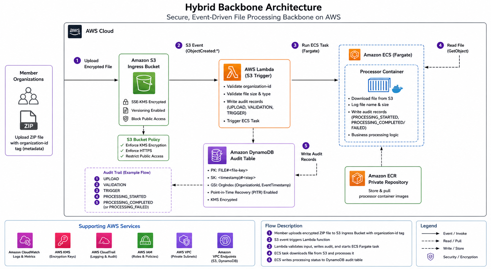

# Hybrid Backbone - Secure Data Orchestration Platform

## Overview
This project builds a secure pipeline to ingest and process files, while keeping track of every step for auditing.

## Architecture

This diagram shows the event-driven workflow:
S3 → Lambda → ECS (Fargate) → DynamoDB audit trail.

## End-to-End Flow 
Here’s what happens when a file is uploaded:

- File is uploaded to S3 ingress bucket with `organization-id` tag
- Lambda function is triggered automatically
- File metadata and organization-id are validated
- ECS Fargate task is started for processing
- Processor container:
  - Downloads file from S3 ingress bucket
  - Extracts organization metadata
  - Processes the file
  - Writes audit records to DynamoDB
- Audit trail captures all stages:
  - UPLOAD_DETECTED
  - VALIDATION_PASSED / FAILED
  - PROCESSING_STARTED
  - PROCESSING_COMPLETED / FAILED

For detailed deployment and testing steps, refer to the [Runbook](RUNBOOK.md).

The system uses:
- S3 for storage (encrypted and private)
- Lambda to validate uploads and trigger processing
- ECS Fargate to run the processing container
- DynamoDB to store audit logs

## Prerequisites
- Terraform >= 1.0
- AWS CLI configured with appropriate credentials
- Docker (for building the processor container)
- Python 3.11 (for local testing)
